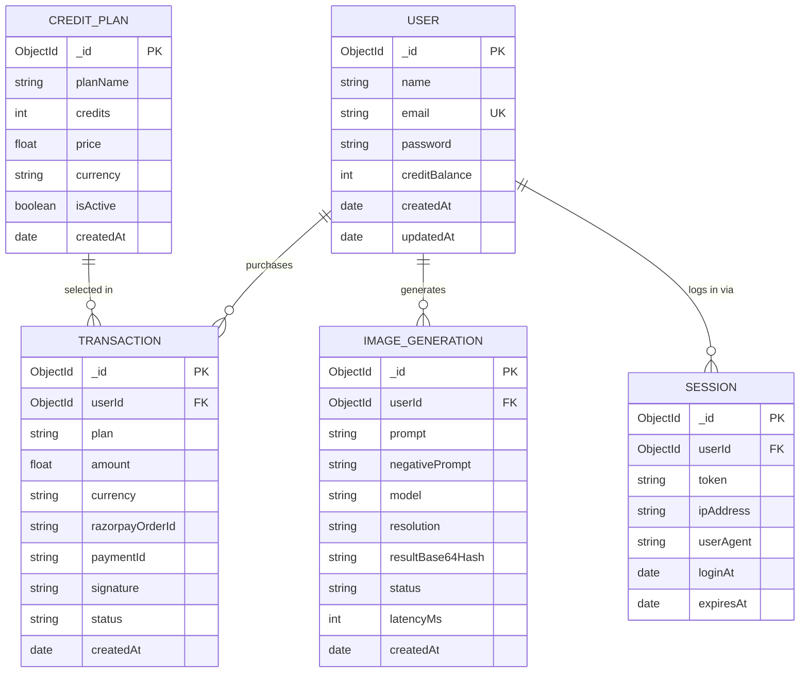
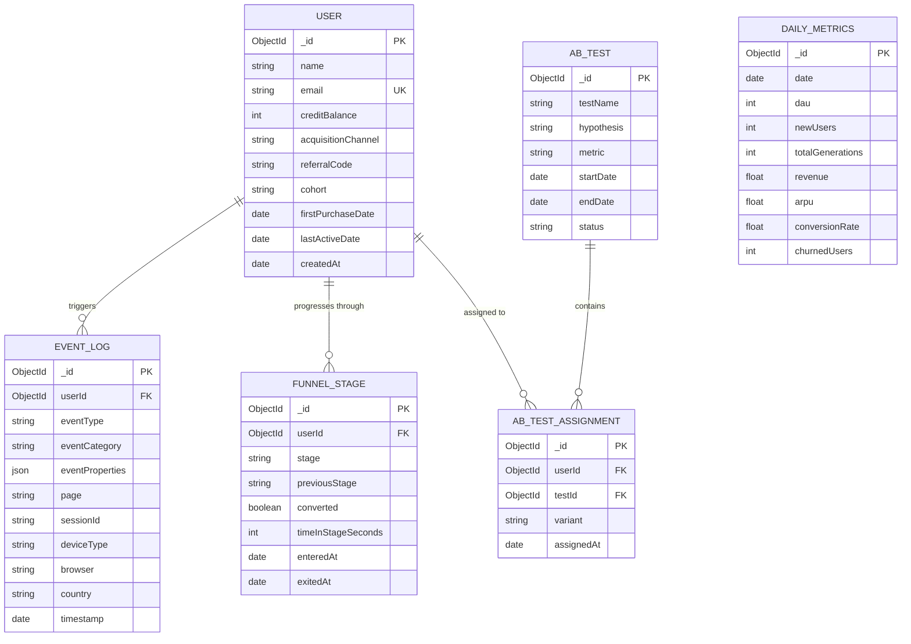
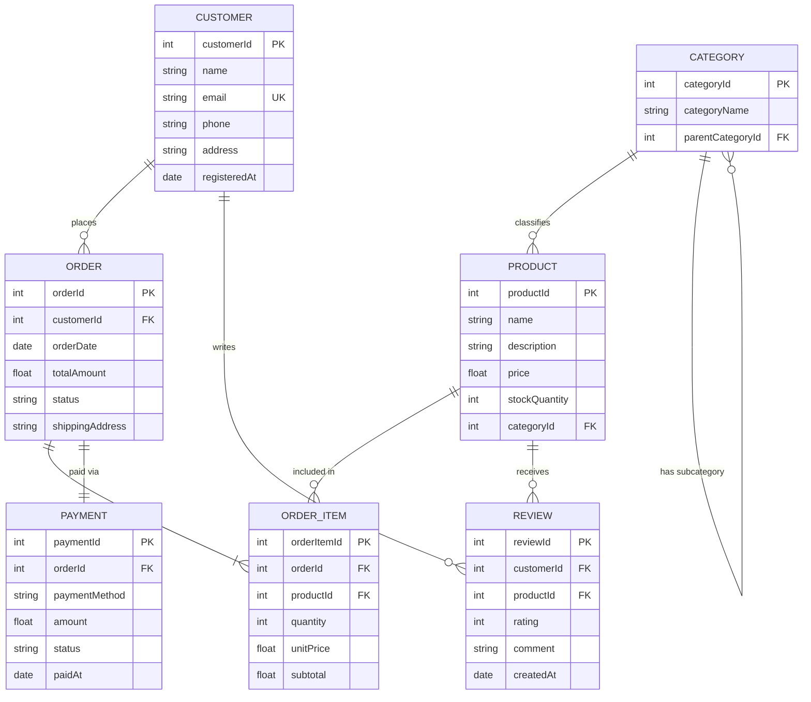

# Product Analyst Interview Preparation — Imagify Project

This document covers **everything** a Product Analyst candidate should be ready for, using the Imagify project as context wherever possible.

---

## Part 1: ER (Entity-Relationship) Diagrams

### 1.1 Core Imagify ER Diagram



> **How to explain this in an interview:**
> "The core entities are **User**, **Transaction**, **Image_Generation**, **Credit_Plan**, and **Session**. A User can have many Transactions (one-to-many). Each Transaction references a Credit_Plan. A User can also generate many images, and each generation log tracks the prompt, model used, status, and latency — which is critical for product analytics. Sessions track login events for user behavior analysis."

---

### 1.2 Extended ER Diagram — Analytics & Product Layer

This is what you'd propose as a **Product Analyst** to enable deeper insights:



> **How to explain:**
> "As a Product Analyst, I would extend the schema to include an **Event Log** for tracking every user interaction (clicks, page views, feature usage), a **Funnel Stage** table to model conversion funnels, and an **A/B Test** system to track experiments. I'd also maintain a **Daily Metrics** rollup table for dashboarding."

---

### 1.3 Classic E-Commerce ER Diagram (Frequently Asked)

Interviewers often ask you to draw an ER diagram for a generic e-commerce platform:



---

## Part 2: SQL Questions (Very Common for Product Analysts)

### Q1: Find the top 5 users by total revenue generated

```sql
SELECT 
    u.name,
    u.email,
    COUNT(t._id) AS total_transactions,
    SUM(t.amount) AS total_revenue
FROM users u
JOIN transactions t ON u._id = t.userId
WHERE t.status = 'completed'
GROUP BY u._id, u.name, u.email
ORDER BY total_revenue DESC
LIMIT 5;
```

### Q2: Calculate Daily Active Users (DAU) for the last 30 days

```sql
SELECT 
    DATE(ig.createdAt) AS generation_date,
    COUNT(DISTINCT ig.userId) AS dau
FROM image_generations ig
WHERE ig.createdAt >= CURRENT_DATE - INTERVAL '30 days'
GROUP BY DATE(ig.createdAt)
ORDER BY generation_date;
```

### Q3: Conversion Rate — Users who signed up vs. Users who made at least one purchase

```sql
SELECT 
    DATE_TRUNC('month', u.createdAt) AS signup_month,
    COUNT(DISTINCT u._id) AS total_signups,
    COUNT(DISTINCT t.userId) AS paying_users,
    ROUND(
        COUNT(DISTINCT t.userId) * 100.0 / NULLIF(COUNT(DISTINCT u._id), 0), 2
    ) AS conversion_rate_pct
FROM users u
LEFT JOIN transactions t ON u._id = t.userId AND t.status = 'completed'
GROUP BY DATE_TRUNC('month', u.createdAt)
ORDER BY signup_month;
```

### Q4: Cohort Retention — Week-over-week retention by signup cohort

```sql
WITH user_cohort AS (
    SELECT 
        _id AS userId,
        DATE_TRUNC('week', createdAt) AS cohort_week
    FROM users
),
activity AS (
    SELECT 
        userId,
        DATE_TRUNC('week', createdAt) AS activity_week
    FROM image_generations
)
SELECT 
    uc.cohort_week,
    EXTRACT(WEEK FROM a.activity_week) - EXTRACT(WEEK FROM uc.cohort_week) AS weeks_since_signup,
    COUNT(DISTINCT a.userId) AS active_users
FROM user_cohort uc
JOIN activity a ON uc.userId = a.userId
WHERE a.activity_week >= uc.cohort_week
GROUP BY uc.cohort_week, weeks_since_signup
ORDER BY uc.cohort_week, weeks_since_signup;
```

### Q5: Find users who bought credits but never generated an image

```sql
SELECT u.name, u.email, u.creditBalance
FROM users u
JOIN transactions t ON u._id = t.userId
WHERE t.status = 'completed'
  AND u._id NOT IN (
      SELECT DISTINCT userId FROM image_generations
  );
```

### Q6: Revenue trend — Month-over-month growth rate

```sql
WITH monthly_revenue AS (
    SELECT 
        DATE_TRUNC('month', createdAt) AS month,
        SUM(amount) AS revenue
    FROM transactions
    WHERE status = 'completed'
    GROUP BY DATE_TRUNC('month', createdAt)
)
SELECT 
    month,
    revenue,
    LAG(revenue) OVER (ORDER BY month) AS prev_month_revenue,
    ROUND(
        (revenue - LAG(revenue) OVER (ORDER BY month)) * 100.0 
        / NULLIF(LAG(revenue) OVER (ORDER BY month), 0), 2
    ) AS mom_growth_pct
FROM monthly_revenue
ORDER BY month;
```

---

## Part 3: Product Metrics & KPIs

### 3.1 Key Metrics for Imagify

| Metric | Formula | Why It Matters |
|--------|---------|----------------|
| **DAU / MAU** | Unique users active per day/month | Measures engagement and stickiness |
| **DAU/MAU Ratio** | DAU ÷ MAU | Stickiness ratio — >20% is good for SaaS |
| **ARPU** | Total Revenue ÷ Total Users | Revenue efficiency per user |
| **ARPPU** | Total Revenue ÷ Paying Users | Revenue from paying segment only |
| **Conversion Rate** | Paying Users ÷ Total Signups × 100 | Free-to-paid funnel health |
| **Churn Rate** | Users lost in period ÷ Users at start × 100 | Retention health |
| **LTV (Lifetime Value)** | ARPU × Avg. Customer Lifespan | How much a user is worth over time |
| **CAC (Customer Acquisition Cost)** | Total Marketing Spend ÷ New Users Acquired | Cost to acquire one user |
| **LTV:CAC Ratio** | LTV ÷ CAC | Must be > 3:1 for sustainable growth |
| **Generation Success Rate** | Successful Generations ÷ Total Attempts × 100 | Product reliability |
| **Avg. Generations per User** | Total Generations ÷ Active Users | Feature adoption depth |
| **Credit Utilization Rate** | Credits Used ÷ Credits Purchased × 100 | Are users getting value? |
| **Time to First Generation** | Time from signup to first image generated | Activation speed |
| **D1 / D7 / D30 Retention** | % of users returning on Day 1, 7, 30 | Retention curve health |

### 3.2 North Star Metric for Imagify

> **"Total Images Successfully Generated per Week"**
> 
> This is the North Star because it directly correlates with:
> - User value (they got what they came for)
> - Revenue (each generation costs a credit, which costs money)
> - Retention (if they generate, they're engaged)

---

## Part 4: Product Sense & Case Study Questions

### Q1: "Imagify's conversion rate dropped from 8% to 4% this month. How would you investigate?"

**Framework (DETECTIVE):**
1. **Define** the metric precisely — Conversion from what to what? Signup → first purchase?
2. **Explore** the data — Segment by acquisition channel, device, geography, plan type
3. **Time** — When exactly did the drop start? Correlate with deployments or campaigns
4. **External** factors — Competitor launched? Seasonality? API issues?
5. **Cohort** analysis — Is it new users converting less, or a specific cohort?
6. **Test** hypotheses — Was pricing changed? Landing page updated? Onboarding broken?
7. **Instrument** — Add event tracking if visibility gaps exist
8. **Validate** — Run an A/B test to confirm the root cause
9. **Execute** — Ship the fix, monitor recovery

### Q2: "Should Imagify launch a subscription model alongside credits?"

**Framework (Think aloud):**
- **Pros:** Predictable recurring revenue (MRR), better for LTV, reduces purchase friction
- **Cons:** Risk of heavy users exploiting unlimited plans, harder to control API costs
- **Data I'd pull:**
  - Distribution of credit purchases per user per month
  - % of users who buy credits more than once per month (subscription candidates)
  - Average credits consumed per paying user
- **Recommendation:** Launch a hybrid model — keep credits for casual users, offer a "Pro" subscription (e.g., 100 images/month for ₹499) for power users. A/B test both flows.

### Q3: "Design a funnel for Imagify and identify where users drop off."

```
Landing Page Visit
        │
        ▼ (Conversion: ~40%)
    Sign Up
        │
        ▼ (Activation: ~60%)
  First Image Generated (Free credits)
        │
        ▼ (Monetization: ~8%)
  First Credit Purchase
        │
        ▼ (Retention: ~30%)
  Repeat Purchase / Return Visit
        │
        ▼ (Referral: ~5%)
  Shares / Invites Friend
```

**Common drop-off points:**
- **Sign Up → First Generation:** Onboarding friction, unclear UI, don't know what to type
- **First Generation → Purchase:** Free credits not exhausted, unclear value, pricing too high
- **Purchase → Repeat:** Quality not meeting expectations, found better alternatives

### Q4: "How would you measure the success of a new 'Prompt Suggestions' feature?"

| Metric | How to Measure |
|--------|---------------|
| Feature Adoption Rate | % of users who click a suggested prompt |
| Impact on Generation Rate | Compare avg. generations/user before vs after |
| Quality Proxy | Do suggested-prompt images get downloaded more? |
| Time to First Generation | Does it decrease for new users? |
| Retention Impact | D7 retention for users who used suggestions vs didn't |
| A/B Test | Control (no suggestions) vs Treatment (with suggestions) |

---

## Part 5: A/B Testing Questions

### Q5: "Walk me through how you'd A/B test a new pricing page for Imagify."

1. **Hypothesis:** "Showing a 'Most Popular' badge on the ₹499 plan will increase its selection rate by 15%"
2. **Metrics:**
   - Primary: Conversion rate (visit pricing page → purchase)
   - Secondary: ARPU, plan distribution
   - Guardrail: Overall revenue doesn't decrease, support tickets don't spike
3. **Randomization:** Randomly assign users (not sessions) to Control vs Variant using a hash of their userId
4. **Sample Size:** Use power analysis — need ~1,500 users per variant for 80% power at 5% significance to detect a 15% lift
5. **Duration:** Run for at least 2 full business weeks to account for day-of-week effects
6. **Analysis:** Use a two-proportion z-test. Check for statistical significance (p < 0.05) and practical significance
7. **Pitfalls to mention:**
   - Peeking at results early inflates false positives
   - Simpson's Paradox — segment by device/channel
   - Novelty effect — monitor post-launch to see if lift sustains

### Q6: "What is statistical significance and why does it matter?"

> "Statistical significance tells us the probability that the observed difference between Control and Variant is NOT due to random chance. We typically use a p-value threshold of 0.05, meaning there's less than a 5% probability the result is a fluke. But significance alone isn't enough — we also need **practical significance** (is the effect size meaningful enough to matter for the business?)."

---

## Part 6: Behavioral & Situational Questions

### Q7: "Tell me about a time you used data to drive a decision."

**STAR Framework:**
- **Situation:** "While building Imagify, I noticed from my server logs that ~30% of image generation requests were failing."
- **Task:** "I needed to identify whether it was a backend issue, an API issue, or a user-input issue."
- **Action:** "I exported the error logs, categorized failures by error type (API timeout, invalid prompt, rate limit), and found that 70% of failures were due to API timeouts during peak hours (2-5 PM IST). I then implemented request retries with exponential backoff."
- **Result:** "The failure rate dropped from 30% to under 5%, and user satisfaction (measured by repeat generation attempts) improved significantly."

### Q8: "How do you prioritize what to analyze?"

> **ICE Framework:**
> - **Impact:** How much will this analysis affect business decisions?
> - **Confidence:** How sure am I that the data is available and reliable?
> - **Ease:** How long will this analysis take?
>
> Score each 1-10, multiply, and rank. Always start with high-impact, high-confidence, low-effort analyses.

### Q9: "Stakeholder asks for a dashboard. How do you approach it?"

1. **Ask:** "What decisions will this dashboard help you make?" (Don't just build what they ask for)
2. **Identify:** Key metrics, audience, update frequency
3. **Design:** Start with a wireframe — executive dashboards need 5-7 KPIs max
4. **Build:** Use tools like Tableau, Looker, Power BI, or Metabase
5. **Iterate:** Share a draft, get feedback, refine

---

## Part 7: Tools & Technical Skills Checklist

| Category | Tools / Skills |
|----------|---------------|
| **SQL** | Joins, Window Functions, CTEs, Subqueries, GROUP BY, HAVING |
| **Python** | Pandas, NumPy, Matplotlib, Seaborn, Scipy (for stat tests) |
| **Excel** | VLOOKUP, Pivot Tables, Conditional Formatting, Charts |
| **BI Tools** | Tableau, Power BI, Looker, Metabase |
| **Analytics** | Google Analytics, Mixpanel, Amplitude, Heap |
| **Statistics** | Hypothesis Testing, Confidence Intervals, Regression, Correlation |
| **Product** | PRDs, User Stories, RICE/ICE Prioritization, OKRs |
| **Communication** | Storytelling with data, Executive summaries, Slide decks |

---

## Part 8: Rapid-Fire Questions (Expect These!)

| Question | Quick Answer |
|----------|-------------|
| Difference between WHERE and HAVING? | WHERE filters rows before aggregation; HAVING filters after GROUP BY |
| What is a CTE? | Common Table Expression — a temporary named result set using WITH clause |
| INNER JOIN vs LEFT JOIN? | INNER returns only matches; LEFT returns all from left table + matches |
| What is a window function? | Performs calculation across a set of rows related to the current row (e.g., RANK, ROW_NUMBER, LAG) |
| Type I vs Type II error? | Type I = False Positive (rejecting true null); Type II = False Negative (failing to reject false null) |
| What is p-value? | Probability of observing results as extreme as the test statistic, assuming the null hypothesis is true |
| Correlation vs Causation? | Correlation = two variables move together; Causation = one CAUSES the other. Correlation ≠ Causation |
| What is survivorship bias? | Analyzing only "surviving" data points and ignoring those that dropped off, leading to skewed conclusions |
| What's a cohort? | A group of users who share a common characteristic (e.g., signup week) used for retention analysis |
| Vanity metric vs Actionable metric? | Vanity = looks good but not useful (total signups). Actionable = drives decisions (conversion rate) |

---

## Part 9: Questions YOU Should Ask the Interviewer

1. "What does the analytics stack look like here? (Data warehouse, BI tool, event tracking)"
2. "How does the product team currently make data-driven decisions?"
3. "What's the biggest analytical challenge the team is facing right now?"
4. "How is the PA role structured — do analysts sit within product squads or in a centralized team?"
5. "What does a typical week look like for a Product Analyst here?"
6. "How do you measure the success of the analytics function itself?"

---

> **Final Tip:** In a Product Analyst interview, **don't just answer — think out loud.** Interviewers want to see your analytical thought process, not just the final answer. Structure your responses, state your assumptions, and always tie back to business impact.
